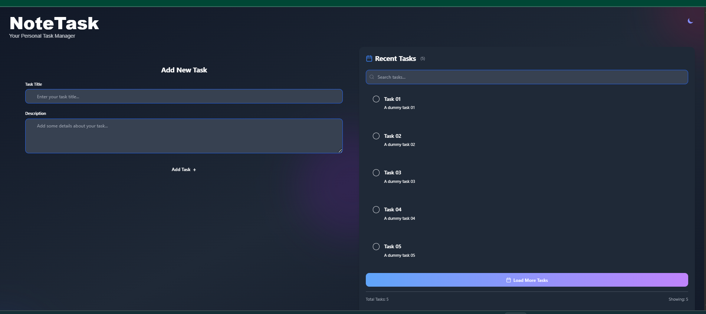

# 📝 NoteTask



A full-stack, dockerized task manager app built with **React**, **Express**, and **MySQL**. NoteTask allows users to create, search, complete, and delete tasks with a beautiful animated UI and theme toggle (light/dark mode). Designed for a clean user experience and performance, the app supports pagination, filtering, and modular frontend-backend separation.

---

## 🚀 Features

- ✅ Create, view, delete, and complete tasks
- 🌈 Light/Dark theme toggle
- 🔍 Search tasks by title or description
- 📦 Pagination (Load More)
- ⚡ Concurrent development with `concurrently`
- 🐳 Dockerized for easy setup and deployment
- 🧠 Responsive and animated modern UI with Tailwind CSS
- 🗄️ Backend powered by Express.js and MySQL

---

```plaintext
📁 Project Structure

NoteTask/
│
├── server/
│   ├── controllers/
│   ├── models/
│   ├── routes/
│   ├── config
│   ├── index.js
│   ├── .env
│   └── Dockerfile (backend)
│
├── client/
│   ├── public/
│   ├── src/
│   │   ├── components/
│   │   └── pages/
│   ├── package.json
│   └── Dockerfile (frontend)
│
├── docker-compose.yml
└── README.md
```

---

## 🛠️ Technologies

- **Frontend**: React, Tailwind CSS, Lucide Icons
- **Backend**: Node.js, Express.js
- **Database**: MySQL
- **Dev Tools**: Docker, concurrently, ESLint
- **Deployment**: Docker Compose

---

## 🐳 Docker Setup

### Prerequisites

- Docker & Docker Compose installed

### Steps

```bash
# Clone the repo
git clone https://github.com/yrgamage/NoteTask.git
cd NoteTask

# Build and start containers
docker-compose up --build
The frontend will be available at: http://localhost:5173
The backend API will be available at: http://localhost:3001

⚙️ Environment Variables
Create a .env file in the backend folder with:

DB_HOST=db
DB_USER=root
DB_PASSWORD=yourpassword
DB_NAME=notetask
PORT=3306

💻 Running Locally (Non-Docker)
In one terminal:

cd server
npm install
npm run dev
In another:

cd client
npm install
npm run dev

This works using concurrently when started via:

npm install
npm run start

📦 API Endpoints

Method	Route	Description

GET	/api/tasks	Get all tasks
POST	/api/tasks	Create a new task
DELETE	/api/tasks/:id	Delete a task

📸 UI Highlights
Clean gradient background

Mobile responsive layout

Dark/light theme toggle


🧪 Future Improvements
JWT authentication
User accounts
Due date & reminder notifications
Editable tasks

🧑‍💻 Author
Yoshani Gamage
